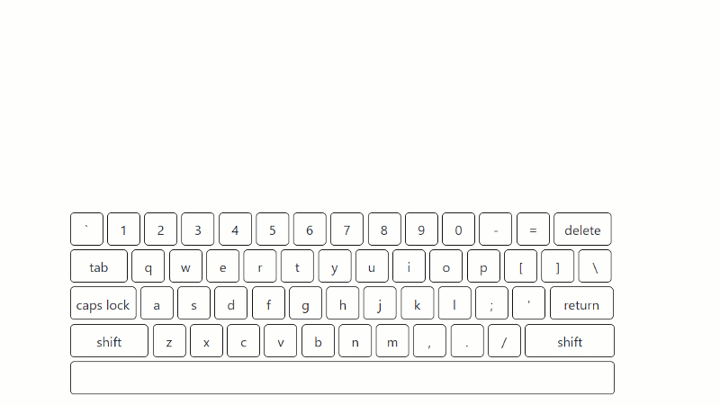

# शब्दावली (shabdawali)
 Amazing human like typping effects with typo, events, dynamic speed and more


<div align="center"></div>


## Features

* Amazing human like typing effects beyond your imagination
* It does typo, and correct them
* Small size 1.7k (when compressed)
* No dependency
* CPU friendly
* Dynamic speed and pauses to type/delete sentences.
* Can be used as jQuery plugin, React component, or with other libraries
* You can fully control it's behavior
* You can use it for playing music notes, typing demo, typing tweets, or typing posts on devRant, twitter, github.
* Check http://amitkumargupta.work for live demo.

# How to use

You can either install it through npm or use directly js from [dist](dist) folder or from some [CDN](https://unpkg.com/shabdawali@2.0.0/dist/shabdawali.js).

```bash
npm i shabdawali
```

```js
var shabdawali = require('shabdawali'); // this line is needed only for nodejs users

shabdawali(el, {
    lines : ["sentence 1", "sentence 2"],
    //other configuration
})
```

## Configuration

### Speed

You can control typing speed, deleting speed, pauses etc. using following configuration

```js
{
    typingSpeed : 75,
    dynamicPauseBeforeDelete : true, 
    pauseBeforeDelete : 2000, 
    pauseBeforeNext : 1000, 
    delay : 0
}
```

### Effects

You can enable disable effects

```js
{
    typoEffect : false,
    repeat : true,
    deleteEffect : true,
}
```

### Events

You may want to play music on piano with key press effect, events can help you

```js
{
    onCharChange : function(char){...};
    onLineChange : function(char, lineNumber, line){...};
    nextWord : function(word){...};
}
```

**Some ideas**

* Keyboard typing effect
* Paino playing effect
* Typewriter strike effect
* Number dial effect
* background change 
* whatever you can think

### Spelling Correction

By default Shabdawali find for words longer than 4 letters, and randomly apply typo effect on maximum 1 word per sentence. Here is the configuration;

```js
{
    max : 1, // Maximum number of typos per line
    minWordLength : 5, //skip words which are smaller than 5 characters
    extendedRange : 3, //How long to type before correction effect
    skip : 2, //how many letters from the starting of a word should be left
    randomFactor : 4 //higher the value lesser the chance to pick a word for typo effect
}
```

You can override `checkIfFitsForTypoEffect(word)` to apply your logic to check if shabdawali whould apply typo effect on current word.

Currently Shabdawali shuffle the letters of a word randomly to apply typo effect. But you can change this behavior by overriding `makeTypo()`.

**Some ideas**

* Apply typo effect on particular words or particular lines.
* Apply typo effect only on particular tye of words.
* Apply the effects like
    * missing vowels,
    * shuffle only 2-3 letters,
    * writing wrong spelling or similar words
    * writing completely wrong sentences
    * writing slang and then star/mask them
    * whatever you can think


### Replacable

When you don't want to make a sentence longer and don't want your reader to read the same sentence again-n-again, you can set `replacable: true` to delete only uncommon part.

Eg

```
"I have worked in India"
"I have worked in Japan"
"I have worked in England"
```

# Integration with other JS libraries


## Jquery Plugin

```JavaScript
(function($){
    $.fn.shabdawali = function(options) {

    return this.each(function() {
        shabdawali($(this), options);
    });
};
  
})(jQuery);
```

## Riot JS Tag

```html
<slate>
    <h1 ref="slat"></h1>
    <script>
        shabdawali(this.refs.slat, this.opts);
    </script>
</slate>
```

## Reat component

```js
//-- check https://github.com/amitguptagwl/shabdawali for more detail

class Slate extends React.Component {
  constructor (props) {
    super(props);
  }
  
  componentDidMount () {
      var props = { lines: [ "शब्दावली (shabdawali)", "It can be used as react component as well"]
    };
    shabdawali(this.el, props);
  }
  
  render(){
  	return <span ref={(el) => { this.el = el; }}>{this.props.children}</span>;
  }
}

ReactDOM.render(
  <div>
	  <Slate />
  </div>,
  document.getElementById('slat')
);
```