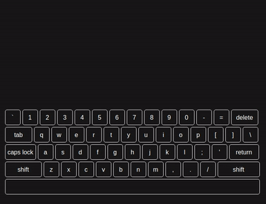

# शब्दावली (shabdawali)
For awesome typewriting effect

## Features

* CPU efficient
* Check http://amitkumargupta.work for live demo.
* You can set if the list should be repeated.
* You can set if you want to see delete effect.
* You can set delay, interval between each line of text.
* Typing speed and deleting speed is calculated as per the length of text.
* You can create custom effects on typing each character or when line changes.

## To Do
* Spelling correction effect
* Dynamix pause based on word complexity
